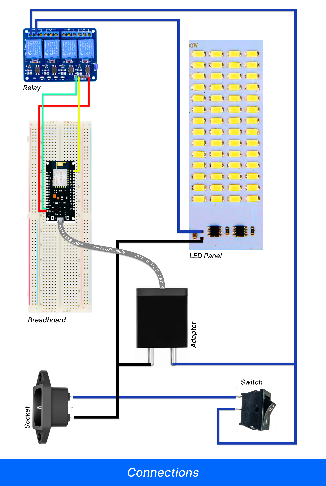

# Smart LED Lamp

 

 

## Objective
    
To build a LED lamp that is Wifi enabled, in simple words we have to make an LED lamp that can be controlled through the internet from any corner of the world.

 

## Requirements

    1. NodeMCU module
    2. Relay Module
    3. USB Adapter
    4. Miro USB cable
    5. Power Socket
    6. Switch
    7. Jumper Wires
    8. Electrical Wires
    9. Breadboard
    10. LED Light(LED panel)
    11. Switchboard(8 ways)

 

 

## How do setup?

 

As above shown in the figure setup all the things, in the same way.

 

## How to boot the NodeMCU (Wifi module) ??
 

## How to assemble everything??
    
After booting the wifi module, stuff everything into the 8-way switchboard. I used some styrofoam for padding the modules inside the board and also attached a layer of tracing paper with acrylic sheets above the LED panel for the diffusion of light with some aluminum foil beneath the panel for heat dissipation or you can do it the way you like as shown below... 👇

 

 

And after doing all the above things properly you will have a good nice looking wifi-enabled LED Lamp... ☺️